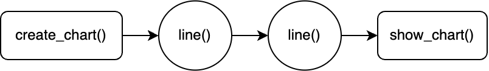

# Chatbot

## Run

Run the following command in terminal

`python manage.py runserver`

## Documentation

### **chatbot.py**

This file contains the code for the chatbot. It uses the `OpenAI API` to load the GPT-4o model and generate responses to user input.

Streamlit has been used to create the user interface for the chatbot.

#### **`load_model()`**

This function loads the GPT-4o model from the OpenAI API. It uses `@st.cache_resource` to cache the model so that it is only loaded once.

#### **`load_tokens()`**

This function stores the API tokens used. This feature is currently under development.

#### **`send_message(message)`**

This function sends a message to the GPT-4o model and returns the response.

Depending on the function call made by the model, the response is either a text message or visualizes data. Functions are called from `utils/functions.py`.

<br>

The remainder of the code is used to create the user interface for the chatbot.

---

### **utils &nbsp;►&nbsp; functions.py**

This file contains the functions that are called by the chatbot to generate responses.

#### **`create_chart(title, x_label, y_label, secondary_y_label)`**

-   title (str): The title of the chart.
-   x_label (str): The label for the x-axis.
-   y_label (str): The label for the y-axis.
-   secondary_y_label (str): The label for the secondary y-axis.

This function creates a chart with the given title, x-axis label, y-axis label, and secondary y-axis label.

Whenever a chart is created in the chatbot, this function is called. Here is an image of the chart creation pipeline:



Results in a chart with two lines.

#### **`show_chart(message)`**

-   message (str): The message to display above the chart.

This function visualizes the chart created by `create_chart()`.

#### **`year_over_year(expression, name, secondary_y, frequency, start_date, end_date, filter_criteria)`**

-   expression (str): Give an expression using column names from the database.
-   name (str): The name of the trace.
-   secondary_y (bool): Whether the y-axis is secondary.
-   frequency (str): The frequency of the data.
-   start_date (str): The start date of the data.
-   end_date (str): The end date of the data.
-   filter_criteria (str): The criteria to filter the data by.

This function adds two line charts to the previously created chart for the current year and previous year respectively.

For e.g. A comparison of total revenue for the current year and previous year.

#### **`table(sql_query, column_names)`**

-   sql_query (str): The SQL query to fetch the data.
-   column_names (list): The names of the columns in the table.

This function creates a table with the data fetched from the database using the given SQL query.

#### **`query(sql_query)`**

-   sql_query (str): The SQL query to fetch the data.

This function fetches the data from the database using the given SQL query and provides it back to the model, the model procedes to analyze the data and generate a response.

#### **`bar(sql_query, x_dim, y_dim, name, secondary_y)`**

-   sql_query (str): The SQL query to fetch the data.
-   x_dim (str): The dimension for the x-axis.
-   y_dim (str): The dimension for the y-axis.
-   name (str): The name of the trace.
-   secondary_y (bool): Whether the y-axis is secondary.

This function creates a bar chart with the given SQL query, x-axis dimension, y-axis dimension, name, and secondary y-axis.

#### **`line(sql_query, x_dim, y_dim, name, secondary_y)`**

-   sql_query (str): The SQL query to fetch the data.
-   x_dim (str): The dimension for the x-axis.
-   y_dim (str): The dimension for the y-axis.
-   name (str): The name of the trace.
-   secondary_y (bool): Whether the y-axis is secondary.

This function creates a line chart with the given SQL query, x-axis dimension, y-axis dimension, name, and secondary y-axis.

#### **`histogram(sql_query, x_dim, bins, name, secondary_y)`**

-   sql_query (str): The SQL query to fetch the data.
-   x_dim (str): The dimension for the x-axis.
-   bins (int): The number of bins for the histogram.
-   name (str): The name of the trace.
-   secondary_y (bool): Whether the y-axis is secondary.

This function creates a histogram with the given SQL query, x-axis dimension, bins, name, and secondary y-axis.

#### **`live_fare_data(origin, orig_countr, destination, dest_country, flight_day, flight_month, flight_year, date_mentioned, display_table, sort_by, ascending, cabin, filter_airline, filter_num_stops, min_price_range, max_price_range, round_trip, round_trip_length)`**

-   origin (str): The origin airport code.
-   orig_countr (str): The origin country code.
-   destination (str): The destination airport code.
-   dest_country (str): The destination country code.
-   flight_day (str): The day of the flight.
-   flight_month (str): The month of the flight.
-   flight_year (str): The year of the flight.
-   date_mentioned (bool): Whether the date was mentioned in the user input.
-   display_table (bool): Whether to display the table.
-   sort_by (str): The column to sort the data by.
-   ascending (bool): Whether to sort the data in ascending order.
-   cabin (str): The cabin class.
-   filter_airline (str): The airline to filter the data by.
-   filter_num_stops (int): The number of stops to filter the data by.
-   min_price_range (int): The minimum price range.
-   max_price_range (int): The maximum price range.
-   round_trip (bool): Whether the flight is round trip.
-   round_trip_length (int): The length of the round trip in days.

This function fetches the fare data from the `Yatra API` and provides it back to the model, the model procedes to analyze the data and generate a response.

#### **`get_tools(functions)`**

-   functions (list): The list of functions to get the tools for.

This function gets the tools for the given functions. This is used to get the tools for the functions that are called by the model.

This function is not called by `chatbot.py`. It is used only when creating an assistant for the chatbot when changes are made to any of the functions or system instructions.

A use case of this code is shown below:

```python
client = OpenAI(api_key="<INSERT-API-KEY>")
assistant = client.beta.assistants.create(
  name="Data Analyst for Air India",
  instructions=open("utils/system-instructions.txt", "r").read(),
  tools=get_tools([
      year_over_year,
      table,
      query,
      create_chart,
      show_chart,
      bar,
      line,
      histogram,
      live_fare_data,
  ]),
  model="gpt-4o",
)
print(assistant.id)
```
